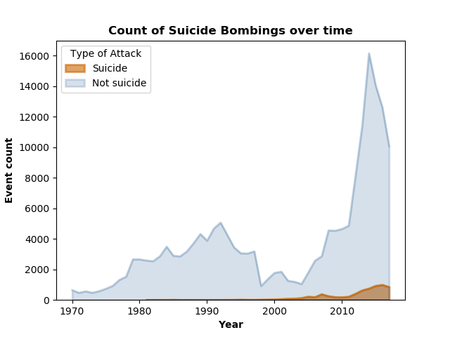
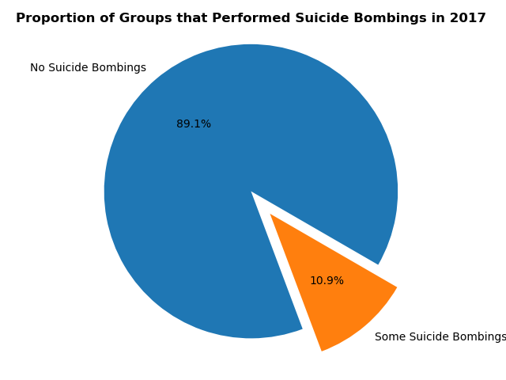
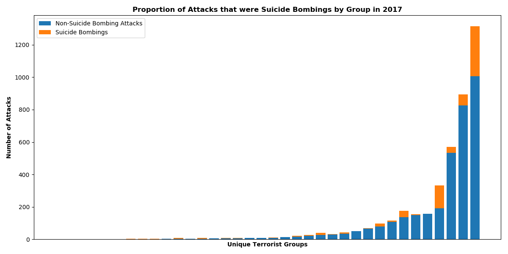
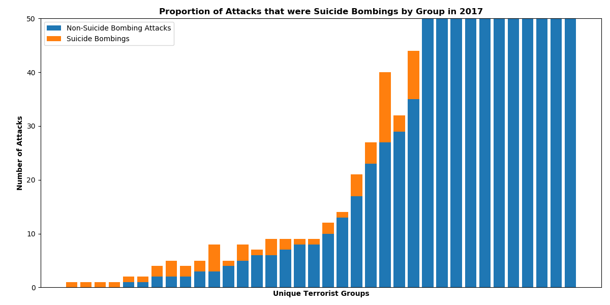
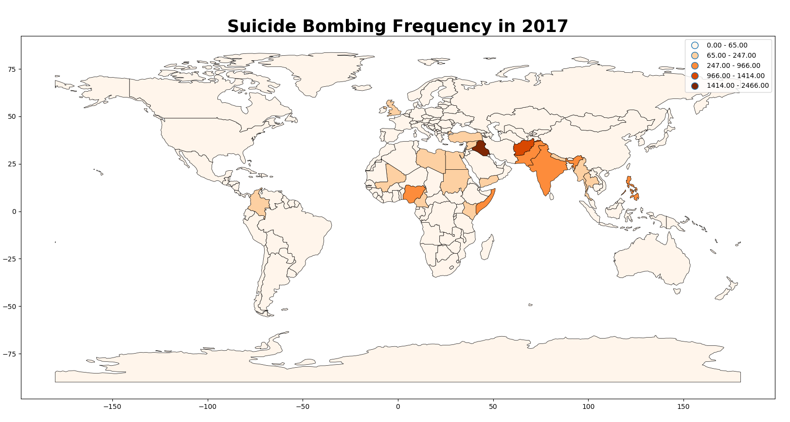
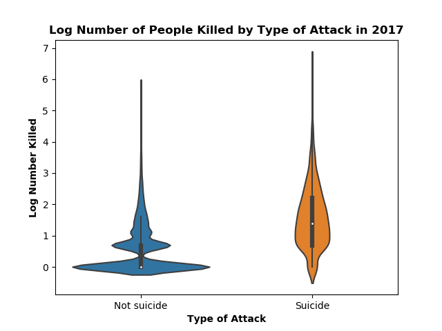
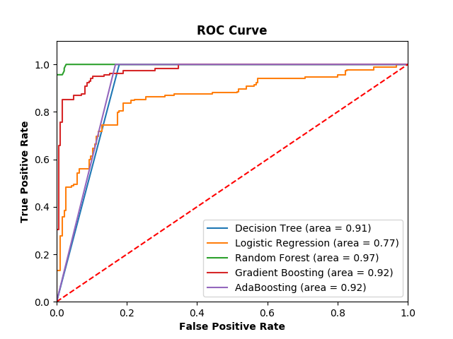
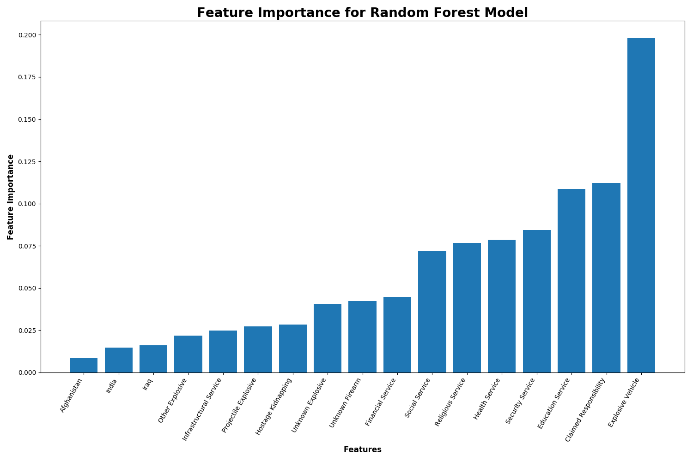

# Understanding Terrorist Behavior: What Type of Groups Engage in Suicide Bombings?
## Jane Stout, Ph.D.

### Background

The [Global Terrorism Database] (GTD) provides information on terrorist attacks that have been documented in the news since 1970. Curated by The National Consortium for the Study of Terrorism and Responses to Terrorism (START), this database indicates suicide bombings are much less common than other types of terrorist attacks. Figure 1 shows a plot of attacks that were classified as suicide bombings vs. non-suicide bombings over time.

**Figure 1. Suicide vs. Non-Suicide Bombings Over Time**

Similarly, when we look at terrorist activity at the group level, we see that the number of groups that do engage in suicide bombings is low and, among those groups, the proportion of attacks that are suicide bombings (versus other types of attacks) is small. See Figure 2a, 2b, and 2c for illustrations of these trends, using GTD data from 2017.

**Figure 2a. Proportion of Groups that Engaged in Suicide Bombing in 2017**

**Figure 2b. Among Groups that Engaged in Suicide Bombings in 2017, Proportion of Attacks that were Suicide Bombings**

In order to see this pattern among groups that conducted relatively few attacks in 2017, we can zoom in on Figure 2b to groups that conducted 50 or fewer attacks (see Figure 2c).

**Figure 2c. Among Groups that Engaged in 50 or Fewer Suicide Bombings in 2017, Proportion of Attacks that were Suicide Bombings**

Suicide bombings tend to be concentrated in specific countries; most countries do not experience suicide bombings as a form of terrorism. Figure 3 displays a heatmap of suicide bombings that occurred in 2017.

**Figure 3. Heatmap of Suicide Bombings in 2017**

Nonetheless, suicide bombings are more deadly than other forms of terrorism; see Figure 4 for a plot of the number of people killed in suicide bombings versus non-suicide bombings in 2017 alone.

**Figure 4. Log Number of Poeple Killed by Suicide vs. Non-Suicide Bombings in 2017**

*Note. Given that the data were heavily skewed right, the data were transformed by adding 1 and then taking the log of each datapoint.*

### Project Goals
- Understand characteristics of terrorist groups that predict whether they engage in suicide bombings
- Understand situations/contexts in which suicide bombings occur
- Build a model that accurately predicts whether or not a terrorist group engages in suicide bombings
  - Focus on *Recall*: Generate a model with very few false negatives
- Interpret my final model's feature importances with an eye toward predicting future suicide bombings

### Data Sources

I used two databases in this project. The first, called the GTD, is an open-source database including information on terrorist events around the world from 1970 through 2017. Unlike many other event databases, the GTD includes systematic data on domestic as well as transnational and international terrorist incidents that have occurred during this time period and now includes more than 180,000 cases. For each GTD incident, information is available on the date and location of the incident, the weapons used and nature of the target, the number of casualties, and--when identifiable--the group or individual responsible.

I also used One Earth Future's (OEF) [Terrorist and Insurgent Organizations' Service Provision across time dataset (TIOS 2.0)] The TIOS 2.0 provides indicators associated with whether and how more than 400 violent non-state actors provide public goods and services across more than four decades (1969–2013). There are 6,659 group-years (i.e., rows) in the TIOS 2.0.

Both the GTD and the TIOS 2.0 create their databases by culling journal articles on terrorist activities and coding for their variables of interest. For instance, for the TIOS 2.0, OEF searched within new stories for words and phrases that correlate with service provisions (see Table 1 for example words).

Of relevance to the current project, the GTD contains one variable indicating whether a given terorrism event was due to a suicide bombing. My primary goal was to use machine learning to model features affiliated with suicide bombing using the GTD and TIOS 2.0. The TIOS 2.0 contains matching variables for the GTD in order to merge the two databases. Doing so allows one to observe individual terrorist group activities in a given year, including the number of suicide bombings groups engaged in.

<!--
   One line of research at OEF focuses on the role of terrorist and insurgent groups (heretofore referred to as “non-state actors") in times of conflict. In particular, OEF studies non-state actors’ use of social services during times of conflict. According to OEF researchers, non-violent activities of violent groups are correlated with many important outcomes and enhance our understanding of the internal functions of terrorist organizations. For instance, some violent groups seek legitimacy and international support through service provision (see Heger & Jung, 2017). -->

<!-- ## Data Description
For this project, I used OEF’s Terrorist and Insurgent Organizations’ Service Provision across time dataset (TIOS 2.0; for more information, see Heger, Jung, and Wagstaff, 2018). The TIOS 2.0 dataset provides indicators associated with whether and how more than 400 violent non-state actors provide public goods and services across more than four decades (1969–2013). Accoring to OEF researchers, an underlying assumption of these data is that service-providing groups will have, on average, more stories mentioning service provision compared with groups that provide fewer or no services (Heger & Jung, 2017). To the best of OEF’s knowledge, this dataset represents the widest coverage across both time and groups for this type of data. -->

<!-- Data were collected from a predetermined list of approximately 400 non-state groups (detailed in Cronin, 2011). Data were pulled from all English language print news coverage available on LexisNexis. As of 2006, LexisNexis has the world's largest electronic database for legal and public-records related information. For each group in the sample, OEF searched within new stories for words and phrases that correlate with service provisions (see _Describing the Data_ section for details). -->

<!-- **From the TIOS 2.0 codebook:**

_"Each observation in the dataset is a group-year. There are, broadly speaking, four sets of variables. The first are the raw counts of keywords. The values for these variables equal the number of times that keyword was mentioned in all of the .txt files for that group-year. The second set of variables are manipulations of the raw counts. These variables include the combinations of the raw counts into sectors as well as taking the mean of all within-sector variables. These give a broader sense of the types of services each group provides each year. The third set of variables provide a sense of coverage using two metrics. The first of these is the word count for each group-year. The second is the article count for each group-year. The last set of variables includes the identifiers for each observation and includes variables suited to merging these data with other commonly used conflict datasets."_ -->

### Exploratory Data Anslysis

This project builds on [my first Capstone], which explored the TIOS 2.0 data, and [my second Capstone], which modeled characteristics of suicide bombings using the GTD database. READMEs for both of those projects outline extensive EDA relating to the GTD and TIOS 2.0.

### Model Building

Recall that my goal was to build a model that would predict whether terrorist groups would engaged in suicide bombings. I opted to use features from the GTD that had feature importances > .04 in a Random Forest model outlined in my Capstone 2 project. I also included public goods and services (i.e., service provisions) provided by terrorist groups, available in the TIOS 2.0 database. Table 1 provides feature labels, names, and details.

**Table 1. Feature Labels, Definitions, and Source**

| Feature label            | Definition                                                                          | Source                
|--------------------------|-------------------------------------------------------------------------------------|-----------------------|
| India                    | Number of attacks a group conducted in India in a given year                        | GTD                   |
| Afghanistan              | Number of attacks a group conducted in Afghanistan in a given year                  | GTD                   |
| Iraq                     | Number of attacks a group conducted in Iraq in a given year                         | GTD                   |
| Hostage Kidnapping       | Number of attacks a group conducted involving hostage(s)/kidnapping in a given year | GTD                   |
| Claimed Responsibility   | Number of times a group claimed responsibilty for an attack in a given year         | GTD                   |
| Explosive Vehicle        | Number of times a group used an explosive vehicle to conduct an attack in a given year | GTD                |
| Projectile Explosive     | Number of times a group used a projectile explosive to conduct an attack in a given year | GTD              |
| Other Explosive       | Number of times a group used an other (unclassified) explosive type to conduct an attack in a given year | GTD |
| Unknown Explosive        | Number of times a group used an unknown explosive type to conduct an attack in a given year | GTD           |
| Unknown Firearm          | Number of times a group used an unknown gun type to conduct an attack in a given    | GTD                   |
| Infrastructural Service  | Number of provisions relating to septic, trash, and reconstruction reported in the news for a particular group in a given year              | TIOS 2.0              |
| Financial Service        | Number of provisions relating to loans and microloans reported in the news for a particular group in a given year              | TIOS 2.0              |
| Social Service           | Number of provisions relating to cultural and social activities, and sports reported in the news for a particular group in a given year              | TIOS 2.0              |
| Religious Service        | Number of provisions relating to church, mosque, madrassa, minister, and temple reported in the news for a particular group in a given year              | TIOS 2.0              |
| Security Service         | Number of provisions relating to militia reported in the news for a particular group in a given year              | TIOS 2.0              |
| Health Service           | Number of provisions relating to health, medic, and clinic reported in the news for a particular group in a given year              | TIOS 2.0              |
| Education Service        | Number of provisions relating to school and teacher reported in the news for a particular group in a given year              | TIOS 2.0              |

### Data Preparation

#### Class Imbalance
As illustrated in Figures 1-2, there is class imbalance in my target variable, which is the proportion of groups that engaged in suicide bombings. To deal with class imbalance, I upsampled my data, resulting in N = 1,476 (n = 738 for each group).

#### Train/Test Dataframes

I generated training and testing samples for the upsampled dataset using the sklearn.model_selection.train_test_split method. I used a 75:25 (train:test) split on the data.

<!-- ### Latent Dirichlet Allocation (LDA)

Next, I sought to use an unsupervised learning technique to create underlying topics in a text variable in the dataset called "Motive". According to the GTD codebook, "When reports explicitly mention a specific motive for the attack, this motive is recorded in the “Motive” field. This field may also include general information about the political, social, or economic climate at the time of the attack if considered relevant to the motivation underlying the incident." For both the "training" and "testing" class-balanced dataframes, I used LDA to generate latent topics for motives. LDA, based on word frequency within a document set, is used to classify text in a documents into topics. -->
<!--
#### Example motives:

+ *The **specific motive is unknown**; however, sources speculated that the attack, which targeted Shiite Muslims, is part of a larger trend of sectarian violence between Iraq's **Shiite** majority and **Sunni** minority communities.*
+ *Specific motive is unknown; however, Al-Qassam Brigades **claimed responsibility** for the incident and they often attack Israeli civilians and soldiers.*
+ *The Communist Party of India - Maoist (CPI-Maoist) claimed responsibility for the incident and stated that the attack was carried out in **protest of United States President Barack Obama's upcoming visit** to India for Republic Day celebrations, scheduled for January 26, 2015.*
+ *Two notes found with Bashar, the suicide bomber in the related case (cf. 200511290002), indicated that the attack was a **preliminary warning** to the forces working to ensure the security of judges and announced the continuation of Jihad until an Islamic welfare state was established in Bangladesh.*  

In addition to using gensim's stopwords, I used the following set of stopwords/stop-phrase relevant to terorrist attacks:
- 'attack', 'bomb', 'bomber', 'bombing', 'carried', 'claim', 'claimed', 'however', 'incident', 'majority', 'minority' 'motive', 'noted', 'responsibility', 'sources', 'specific', 'speculate', 'speculated', 'State', 'state', 'stated', 'statement', 'States', 'suicide', 'target', 'targeted', 'targeting', 'Unknown', 'unknown'
- 'The specific motive for the attack is unknown.'

To determine an optimal number of latent topics, I plotted Coherence Scores (higher is better) for a range of 1-10 topics (see Figure 4). The plot showed two trends:
1. Two topics were optimal, with a coherence score of .39
2. Coherence increased as the number of topics increased

**Figure 4. LDA Coherence Scores for a Range of 1-10 Topics**

When I inspected a visual representation of latent 10 topics (see Figure 5), I noted the clustering looked most like a three topic pattern. Modeling with 10 topics had a coherence score .35.

**Figure 5. A Visualzation of an LDA Model with 10 Latent Topics**

Thus, I opted to model the data using three clusters (see Figure 6); this model had a coherence score of .30.

**Figure 6. A Visualzation of an LDA Model with 3 Latent Topics**

After generating LDA scores for three topics for each case in both the training and testing dataframes, I merged the LDA scores into the original training and testing dataframes. Note that cases were dropped that did not have LDA scores (i.e., text in the motive column consisted only of stopwords/stop phrases). -->

### Modelling

I first ran two Decision Tree models where features were either (a) a count of the number of times a feature occured in a group-year, or (b) a binary indicator of whether or not a feature occurred in a given group year (see Table 2). I observed Accuracy, Recall, and Precision in order to select the optimal model. I focused particularly on Recall, which is an important index for predicting suicide bombings. That is, it is important to "catch" groups that may engage in a suicide bombings in a given year, which is reflected by the Recall score.

**Table 2. Decision Tree Statistics and Model Characteristics**

|          |Feature structure| Accuracy | Recall | Precision | N size   (testing) |
|----------|-----------------|----------|--------|-----------|-------------------------|
| Model 1  |           Count | .91      | 1.00   | .86       | 369                     |
| Model 2  |           Binary| .85      | .95    | .79       | 369                     |

<!-- A tree diagram of Model 6 is displayed in Figure 7. This diagram gives a sense for how Decision Trees work. However, Model 6 is an over-simpoified model. A better model is Model 3, which is displayed in Figure 8. This figure shows a much more complex model that is no longer easy to intepret visually. -->
<!--
**Figure 7. A Tree Diagram of Model 6**

**Figure 8. A Tree Diagree of Model 3**

 -->

I selected Model 1 for the next phase of model testing because this model had a higher recall score that Model 2. Next, I ran Model 1 through a series of algorithms (see Table 3 and Figure 5). I found that model fit statistics using a Random Forest model were slightly better than the remaining models.

**Table 3. Model Statistics and Hyperparameters for Algorithms**

|                     | Hyperparameters             | Accuracy | Recall  | Precision |
|---------------------|-----------------------------|----------|---------|-----------|
| Decision Tree       |                             | .91      | 1.00    | .85       |
| Logistic Regression |                             | .77      |  .66    | .85       |
| Random Forest       | 100 trees                   | .97      | 1.00    | .94       |
| Gradient Boosting   | 100 trees, .1 learning rate | .92      |  .93    | .91       |
| AdaBoosting         | 100 trees, .1 learning rate | .92      | 1.00    | .86       |

**Figure 5. ROC Curves for Five Algorithms Testing Model 3.**

Using a Random Forest Classification, I created a confusion matrix (Figure 6) and displayed feature importances (Figure 7).

**Figure 6. Confusion Matrix Using Random Forest Classification.**

**Figure 7. Feature Importances Using Random Forest Classification**

**Table 4. T tests Assessing Whether Groups that Engage in Suicide Bombings Differ in Feature Prevalence**
<!--
| Feature label            | Statistics                    | Interpretation                                               |
|--------------------------|-------------------------------|--------------------------------------------------------------|
| India                    | t(14951.36) = -2.09, p > .0004 | |
| Afghanistan              | t(34390.85) = 8.50, p < .0004| |
| Iraq                     | t(34403.12) = 7.11, p < 0004 | |
| Hostage Kidnapping       | t(43400.22) = 6.73, p < .0004 | |
| Claimed Responsibility   | t(36755.31) = 11.70, p < .0004 | |
| Explosive Vehicle        | t(35375.66) = 12.17, p < .0004| |
| Projectile Explosive     | t(41408.15) = 14.51, p < .0004| |
| Other Explosive          | t(47699.82) = 4.08, p < .0004| |
| Unknown Explosive        | t(41200.34) = 8.41, p < .0004| |
| Unknown Firearm          | t(46432.51) = 9.94, p < .0004| |
| Infrastructural Service  | t(47875.43) = 13.11, p < .0004| |
| Financial Service        | t(45622.14) = 13.80, p < .0004 | |
| Social Service           | t(29209.85) = 5.14, p < .0004 | |
| Religious Service        | t(47139.81) = 12.94, p < .0004)| |
| Security Service         | t(44948.98) = 10.14 p < .0004| |
| Health Service           | t(45075.34) = 14.76, p < .0004| |
| Education Service        | t(42998.30) = 14.75, p < .0004| || -->

| Feature label            | Statistics                    | Interpretation                                               |
|--------------------------|-------------------------------|--------------------------------------------------------------|
| India                    | *t*(1475) = -2.24, *p* .0004 | Groups that engage in suicide bombings (versus those that do not) do not differ in the number of attacks they conduct in India|
| Afghanistan              | *t*(1475) = 5.57, *p* < .0004| Groups that engage in suicide bombings (versus those that do not) conduct significantly more attacks in Afghanistan|
| Iraq                     | *t*(1475) = 4.69, *p* < 0004 | Groups that engage in suicide bombings (versus those that do not) conduct significantly more attacks in Iraq|
| Hostage Kidnapping       | *t*(1475) = 5.21, *p* < .0004 | Groups that engage in suicide bombings (versus those that do not) use hostage/kidnapping significantly more often|
| Claimed Responsibility   | *t*(1475) = 8.01, *p* < .0004 | Groups that engage in suicide bombings (versus those that do not) claim responsibility for their attacks significantly more often|
| Explosive Vehicle        | *t*(1475) = 8.18, *p* < .0004| Groups that engage in suicide bombings (versus those that do not) use significantly more explosive vehicles|
| Projectile Explosive     | *t*(1475) = 9.94, *p* < .0004| Groups that engage in suicide bombings (versus those that do not) use significantly more projectile explosives|
| Other Explosive          | *t*(1475) = 3.34, *p* > .0004| Groups that engage in suicide bombings (versus those that do not) do not differ in their use of firearms of "other" type|
| Unknown Explosive        | *t*(1475) = 5.85, *p* < .0004| Groups that engage in suicide bombings (versus those that do not) use significantly more explosives of unknown type|
| Unknown Firearm          | *t*(1475) = 7.04, *p* < .0004| Groups that engage in suicide bombings (versus those that do not) use significantly more firearms of unknown type|
| Infrastructural Service  | *t*(1475) = 8.88, *p* < .0004| Groups that engage in suicide bombings (versus those that do not) provide significantly more infrastructural services|
| Financial Service        | *t*(1475) = 9.32, *p* < .0004 | Groups that engage in suicide bombings (versus those that do not) provide significantly more financial services|
| Social Service           | *t*(1475) = 3.67, *p* < .0004 | Groups that engage in suicide bombings (versus those that do not) provide significantly more social services|
| Religious Service        | *t*(1475) = 8.90, *p* < .0004| Groups that engage in suicide bombings (versus those that do not) provide significantly more religious services|
| Security Service         | *t*(1475) = 7.39, *p* < .0004| Groups that engage in suicide bombings (versus those that do not) provide significantly more security services|
| Health Service           | *t*(1475) = 10.00, *p* < .0004| Groups that engage in suicide bombings (versus those that do not) provide significantly more health services|
| Education Service        | *t*(1475) = 9.83, *p* < .0004| Groups that engage in suicide bombings (versus those that do not) provide significantly more education services||

<!-- | Feature label            | Significant?                    | Interpretation                                               |
|--------------------------|-------------------------------|--------------------------------------------------------------|
| India                    | No | |
| Afghanistan              | Yes | |
| Iraq                     | Yes | |
| Hostage Kidnapping       | Yes | |
| Claimed Responsibility   | Yes | |
| Explosive Vehicle        | Yes | |
| Projectile Explosive     | Yes | |
| Other Explosive          | Yes | |
| Unknown Explosive        | Yes | |
| Unknown Firearm          | Yes | |
| Infrastructural Service  | Yes | |
| Financial Service        | Yes | |
| Social Service           | Yes | |
| Religious Service        | Yes | |
| Security Service         | Yes | |
| Health Service           | Yes | |
| Education Service        | Yes | || -->

*Note. Independent samples t tests were conducted using a Bonferonni correction (adjusted critical p value = .0004).*

### Implications: Interpreting Feature Importance
We can use feature importances (see Figure 7) and directional effects observed from t tests (see Table 4) to make assumptions about groups that conduct suicide bombings. The most important feature in predicting whether groups engage in suicide bombing is their use of explosive vehicles to conduct attacks. That is, groups that engage in suicide bombings use explosive vehicles significnatly more often than groups that do not engage in suicide bombings.

Terrorist groups that use suicide bombing are also more likely to claim responsibility for their attacks than their counterparts, suggesting the former seek notoriety for their deeds. That is, these groups are forthcoming and tend not to hide in the shadows.

Finally, groups that engage in suicide bombings tend to provide significantly more services than groups that do not engage in suicide bombings. According to OEF researchers, some violent groups seek legitimacy and international support through service provision (see Heger & Jung, 2015).

Taken together, this work suggests authorities and individuals should be particularly **vigilent in areas that have a high density of vehicles**. Authorities should **monitor terriost groups that have claimed responsibility** for suicide bombings in the past -- particularly those that **provide services for their communities**.

<!-- ### Future Directions

#### Theoretical
- Consider other data sources to merge into GTD that could help explain suicide bombings
- Model domestic forms of terrorism (i.e., in the United States)

#### Technical
- Run Regularized Logistic Regression Analyses
- Then, do a grid search on hypter parameters for the final algorithm I select.
- Refactor my code so that is uses classes rather than functions. -->

## References
<!-- Cronin, A. K. (2011) _How Terrorism Ends: Understanding the Decline and Demise of Terrorist Campaigns._ Princeton, NJ: Princeton University Press. -->

Heger, Lindsay L. and Danielle F. Jung (2015) Negotiating with rebels: The effect of rebel service provision on conflict negotiations. _Journal of Conflict Resolution, 61,_ 1203-1229.

 

 

[codebook]: https://www.start.umd.edu/gtd/downloads/Codebook.pdf
[Global Terrorism Database]: https://www.start.umd.edu/gtd/about/
[Terrorist and Insurgent Organizations' Service Provision across time datasets (TIOS 2.0)]: https://oefresearch.org/datasets/tios-v2
[my first Capstone]: https://github.com/gagejane/Capstone1
[my second Capstone]: https://github.com/gagejane/Capstone2
